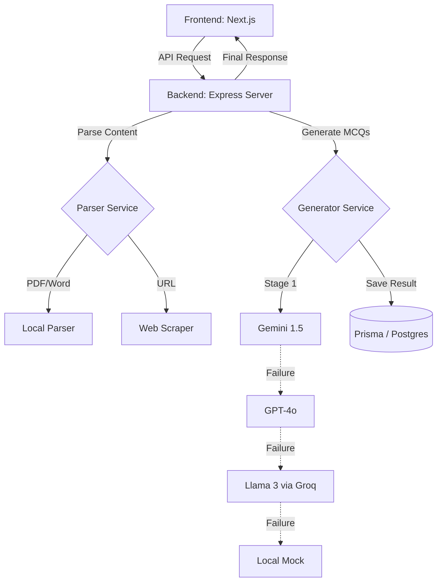

# 🧠 BrainStack.AI: The Advanced Neural Assessment Engine

[](https://nextjs.org/)
[](https://www.typescriptlang.org/)
[](https://github.com/Dinesh2112/Brain-Stack/blob/main/LICENSE)
[](https://ai.google.dev/)

**BrainStack.AI** is a high-performance, industry-ready platform designed to generate academic-grade Multiple Choice Questions (MCQs) from any source—be it a complex topic, a website URL, or uploaded documents (PDF/DOCX). 

Built with a **Triple-Stack AI Fallback** system, BrainStack.AI ensures 100% uptime and academic accuracy by orchestrating between the world's most powerful LLMs.

---

## 🚀 Key Features

### 📡 Multi-Source Question Generation
*   **Topic-Based:** Generate deep-dive questions by just typing a subject.
*   **Web Scraping:** Paste any article URL, and BrainStack.AI extracts the core context instantly.
*   **File Analysis:** Upload PDF or DOCX files for high-precision, document-specific assessments.

### 🛡️ Triple-Stack AI Architecture
We solve the "Hallucination & Quota" problem by using a resilient 3-layer fallback:
1.  **Tier 1:** Google **Gemini 1.5 Flash** (Primary for speed & context)
2.  **Tier 2:** OpenAI **GPT-4o Mini** (High-precision secondary)
3.  **Tier 3:** **Llama 3 (via Groq)** (High-speed, 100% free fallback)
4.  **Tier 4:** Local **Mock Service** (Ensures UI never breaks)

### 📊 Gamified Results View
*   **Subject Pulse Analytics:** Beautiful category-wise performance charts using Recharts.
*   **Performance Badges:** Earn specialized badges like *Scholar*, *Speedster*, or *Perfectionist*.
*   **Visual Verdict:** Detailed response audit trails with "Analytical Breakdowns" for every correct answer.
*   **Confetti Celebration:** Haptic and visual feedback for high-performers.

---

## 🛠️ Technology Stack

| Layer | Technologies |
| :--- | :--- |
| **Frontend** | Next.js 16 (App Router), Tailwind CSS 4, Framer Motion, Recharts, Lucide Icons |
| **Backend** | Node.js, Express, TypeScript, Multer, Zod |
| **Database** | PostgreSQL + Prisma ORM |
| **Parsing** | pdf-parse, mammoth, cheerio (Web Scraping) |
| **Services** | Google Generative AI, OpenAI, Groq SDK |

---

## 🏛️ System Architecture



---

## ⚡ Getting Started

### Prerequisites
*   Node.js (v18+)
*   npm or yarn
*   PostgreSQL instance

### 1. Clone the repository
```bash
git clone https://github.com/Dinesh2112/Brain-Stack.git
cd Brain-Stack
```

### 2. Backend Setup
```bash
cd backend
npm install
```
Create a `.env` file in the root of the backend folder:
```env
PORT=5001
DATABASE_URL="your_postgresql_url"
GEMINI_API_KEY="your_google_ai_key"
OPENAI_API_KEY="your_openai_key"
GROQ_API_KEY="your_groq_key"
JWT_SECRET="your_secure_secret"
```
Initialize Database:
```bash
npx prisma generate
npx prisma db push
```
Start Backend:
```bash
npm run dev
```

### 3. Frontend Setup
```bash
cd ../frontend
npm install
```
Start Development Server:
```bash
npm run dev
```

The application will be running on `http://localhost:3000`.

---

## 🛡️ Production Readiness
*   **Rate Limiting:** Protects the AI credit consumption from abuse.
*   **Structured Logging:** Professional logging for debugging and audit trails.
*   **Global Error Handling:** Clean, user-friendly error responses.
*   **Secure API Layers:** Environment variable protection and structured interfaces.

---

## 🤝 Contributing
Feel free to fork this project and submit PRs. For major changes, please open an issue first to discuss what you would like to change.

## 📄 License
This project is licensed under the [MIT License](LICENSE).

---

Developed with ❤️ for Academic Excellence.
